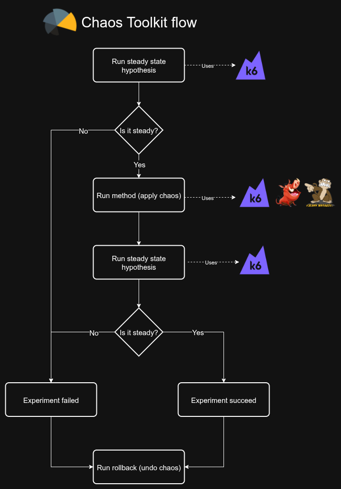

# Dungeon Game Kata

A Spring Boot application that solves dungeon path optimization problems with minimum health points calculation.

## Quick Start

```shell
docker compose up --build
```

## Architecture

The application runs with high availability setup:
- **HAProxy Load Balancer** - `http://localhost:80` (dashboard: `http://localhost:8404/stats`)
- **3 Application Instances** - Load balanced backend servers
- **PostgreSQL Database** - Persistent storage for solved dungeons
- **Frontend UI** - React-based dungeon visualizer

## Architecture Diagram


This diagram shows the overall architecture and highlights how each chaos testing tool interacts with the system components.

## Server
- `http://localhost:8081` (direct access)
- `http://localhost:80` (via HAProxy)
- `http://localhost:9050` app3 (Chaos Monkey profile)


## Steps of Chaos Engineering

1. Start by defining ‘steady state’ as some measurable output of a system that indicates normal behavior.
2. Hypothesize that this steady state will continue in both the control group and the experimental group.
3. Introduce variables that reflect real world events like servers that crash, hard drives that malfunction, network connections that are severed, etc.
4. Try to disprove the hypothesis by looking for a difference in steady state between the control group and the experimental group.

## Chaos toolkit flow Diagram



## Swagger UI

`http://localhost:80/swagger-ui.html`

## REST endpoints

- GET `/hello`
  - Response: `{"status": "ok"}`

- POST `/dungeon/solve`
  - Request body: `[[1,-3,3],[0,-2,0],[-3,-3,-3]]`
  - Response: `{ "minimumHP": 3, "path": [ [ 0, 0 ], [ 0, 1 ], [ 0, 2 ], [ 1, 2 ], [ 2, 2 ] ] }`

- GET `/actuator/health`
  - Health check endpoint

## Testing

### Basic API Test
```bash
curl -s -X POST http://localhost:8080/dungeon/solve \
 -H "Content-Type: application/json" \
 -d '[[1,-3,3],[0,-2,0],[-3,-3,-3]]'
```

### Database Inspection
```bash
docker exec -it dungeon-game-kata-db-1 \
 psql -U app -d appdb -c "SELECT id, input, output, created_at FROM model_runs ORDER BY id DESC;"
```

## Frontend

React-based UI for dungeon visualization and solving:

```shell
cd ui
npm i
npm run dev # development server
npm run build && npm run preview # production build
```

## Chaos Engineering

The project includes comprehensive chaos engineering experiments using Chaos Toolkit with custom tooling.

### Setup

Install required tools:
```bash
# Install Python 3 and pip
sudo apt update
sudo apt install python3 python3-pip

# Install Chaos Toolkit and Spring extension
pip install -r experiments/requirements.txt

# Build custom chaos toolkit container (recommended)
cd experiments
docker build -t custom-chaos-image ./chaostoolkit
```

### Running Experiments

Using the custom container (recommended):
```bash
cd experiments
docker run --rm --network=host -v .:/experiments -v ./logs:/home/chaostoolkit/logs custom-chaos-image run /experiments/database-failure.json
```

Using local installation:
```bash
chaos run experiments/database-failure.json
```

### Monitoring

- **HAProxy Dashboard**: `http://localhost:8404/stats` - View server health and load distribution
- **Experiment Logs**: `experiments/logs/` - Detailed execution logs and journals

## Development

### Debugging
The application supports remote debugging on port 5005:
```bash
./gradlew bootRun -Dagentlib:jdwp=transport=dt_socket,server=y,suspend=n,address=*:5005
```

### Build
```bash
./gradlew clean build
```
